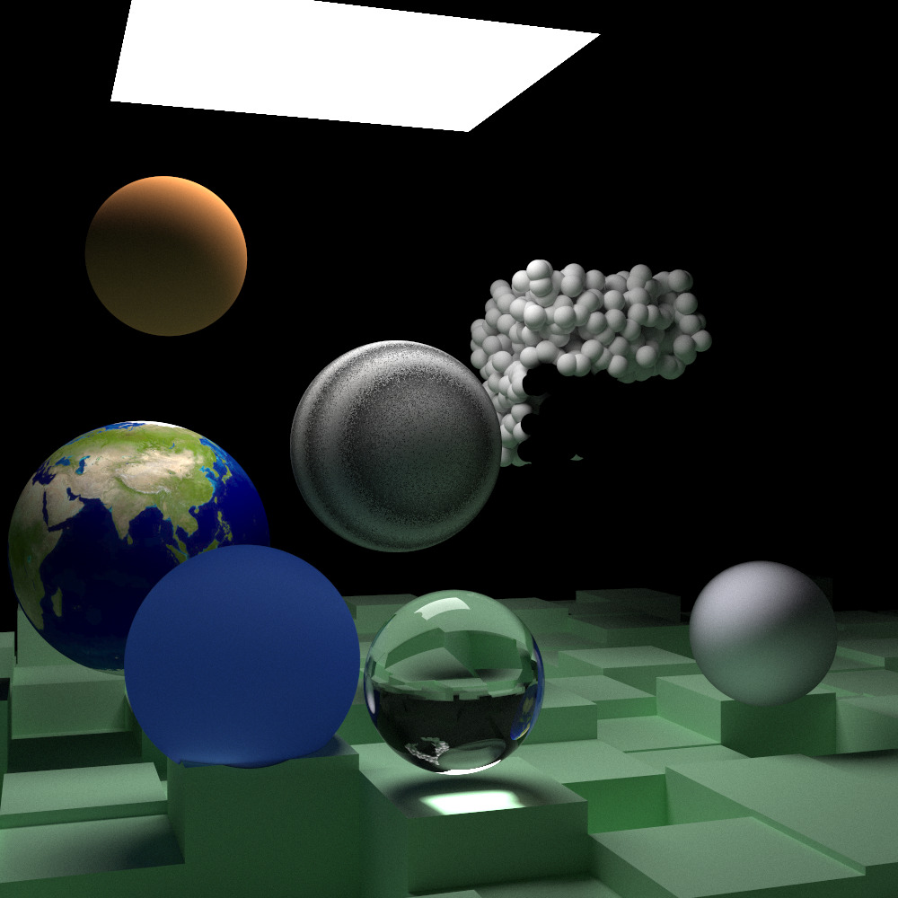

# Raytracing Series
The Raytracing Series **(Python GPU version)**



## Features

- GPU-accelerated rendering using [Taichi](https://www.taichi-lang.org/)
- Interactive viewer with mouse-controlled camera rotation
- Advanced materials: Lambertian, Metal, Dielectric, Emissive, Subsurface Scattering
- Volumetric rendering (fog/smoke)
- BVH acceleration with SAH optimization
- Perlin noise textures
- OBJ mesh loading
- Motion blur and depth of field
- Both megakernel and wavefront rendering architectures

For a comprehensive list of features, see [docs/optimizations.md](docs/optimizations.md).

## Running the Code

### Interactive Mode
Run the path tracer with live preview:

```bash
python3 src/main.py
```

This will:
- Launch an interactive window with progressive rendering
- Allow camera rotation with left-click and drag
- Save the final image to `temp/` as PNG when closed

### Selecting Scenes
Edit `src/main.py` to choose different scenes:

```python
def main():
    vol2_final_scene_comparison()  # Complex scene with 1000+ objects
    # wavefront_comparison()       # Simple comparison scene
    # vol2_final_scene()           # Original final scene
```

## Performance Profiling

The code includes built-in cProfile instrumentation to analyze performance bottlenecks.

### Running the Profiler

When you run the main script, profiling data is automatically collected:

```bash
python3 src/main.py
```

This will:
- Render the scene with interactive preview
- Save profiling data to `temp/profile_output.prof`

### Visualizing Profile Data

#### SnakeViz (Interactive Browser Visualization)

Install and visualize with interactive sunburst/icicle charts:

```bash
pip install snakeviz
snakeviz temp/profile_output.prof
```

Features:
- Interactive sunburst chart showing call hierarchy
- Icicle chart with rectangular blocks for time distribution
- Hover to see detailed timing information
- Click to drill down into specific function calls

### Understanding Profile Output

Key metrics to focus on:
- **tottime**: Time spent in the function itself (excluding subfunctions)
- **cumtime**: Total time spent in the function and all functions it calls
- **ncalls**: Number of times the function was called

Common bottlenecks in GPU-accelerated raytracers:
- BVH construction and flattening
- Scene compilation to GPU format
- Kernel compilation (first run only)
- Data transfer between CPU and GPU
- Interactive viewer updates
